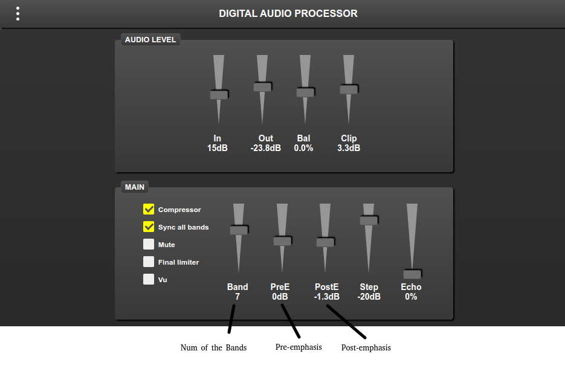
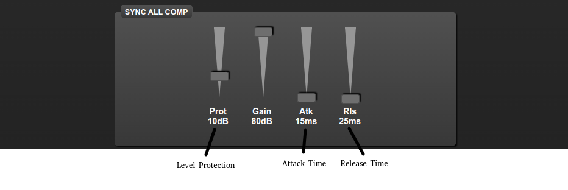
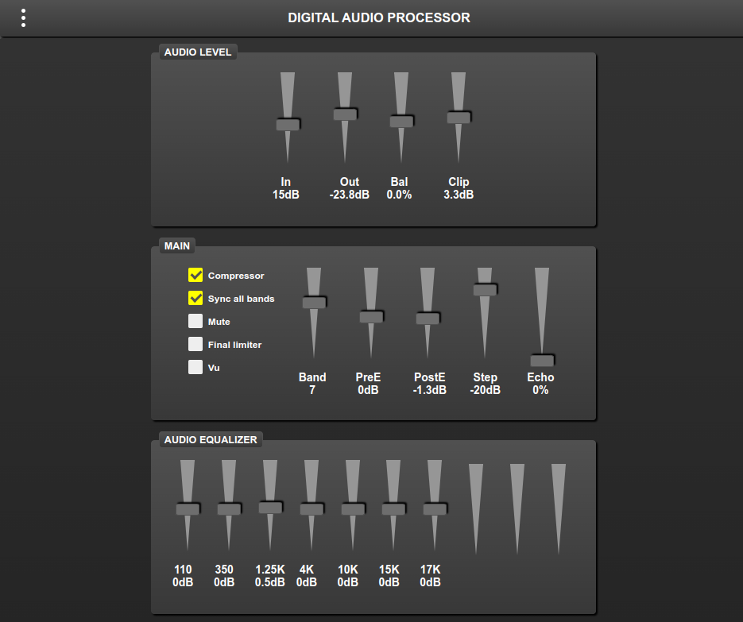
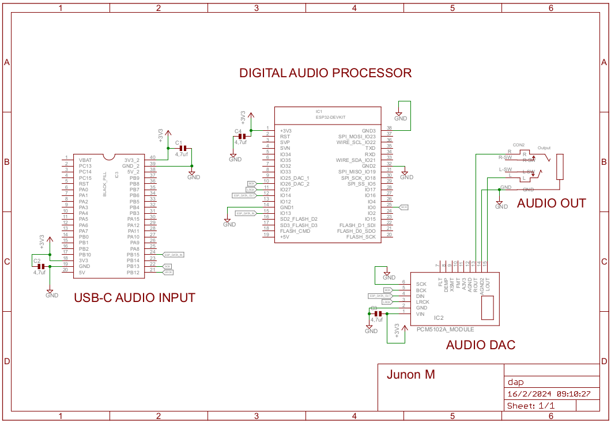
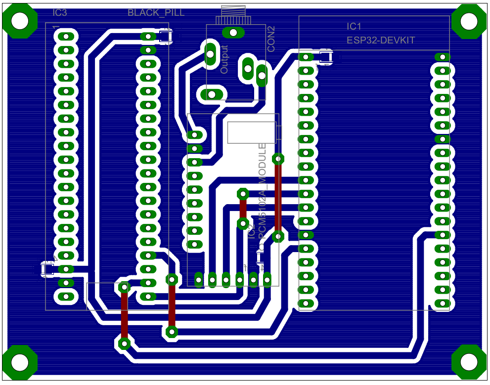
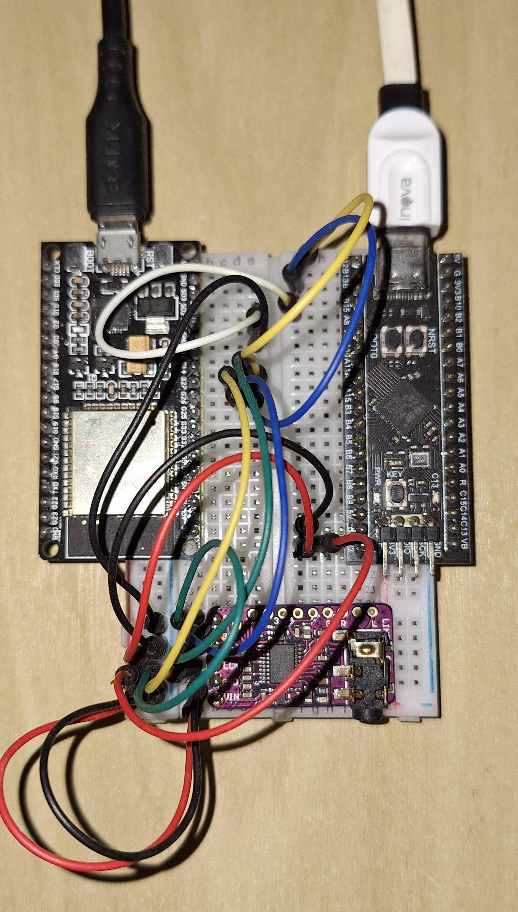
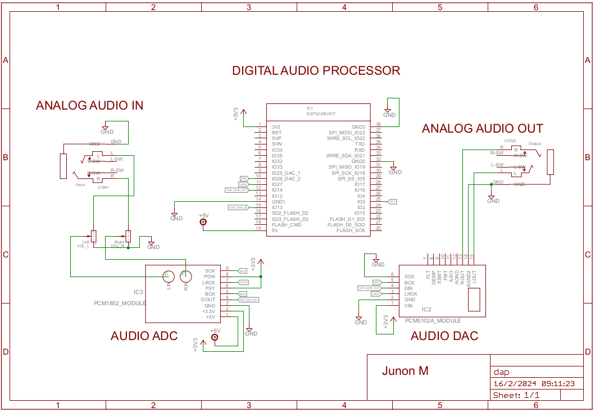

# Esp32 Multiband Digital Audio Processor

## Features

* Web interface for control and configuration.
* Adjustment of the number of frequency bands in real time from 1 to 10.
* Graphic equalizer.
* Audio echo.
* Independent or synchronized adjustments for each audio compressor.
* Audio VU (low speed).
* Audio balance adjustment.
* Audio Pre-emphasis and Post-emphasis by software.
* Output audio peak protection system.
* Settings saving system with preset files.
* Circuit power supply directly from the USB port.
* Simplified scheme with a low number of electronic components.

<br/>
<h2>Audio level and main</h2>


<br/>
<h2>Compressor</h2>


<br/>
<h2>Digital Audio Processor</h2>


<br/>
<h2>Schematic (Digital Usb Input)</h2> 


<br/>
<h2>PCB Layout (Digital Usb Input)</h2> 


<br/>
<h2>Prototype (Digital Usb Input)</h2> 


<br/>
<h2>Schematic (PCM1802 ADC Input)</h2> 


## Recommended compilation settings

* Microprocessor: ESP32 WROOM Devkit
* Rom: 4MB, Minimal SPIFFS large Apps with OTA
* Ram: Internal ~ 350 KBytes
* Ide: Arduino v1.8.19
* Board Version Support: Esp32 v2.0.7
* Use ArduinoJson 5.x! Please type in the terminal window in the folder ArduinoJson to set 5.x version:
```bash
 git checkout 5.x
``` 
* ArduinoJson 6.x and 7.x use a lot of memory and are not suitable for this project!
* This project does not work with the latest versions!
* The tools folder should be copied to your ~/Documents/Arduino folder if you haven't already installed Esp32 Sketch Data Upload (Required to upload the data folder into Esp32's SPIFFS memory).

## Tips

* The recommended input level is 15dB for PC volume control at 50%.
* To change a slider, first click on it and move it with the directional keys for better precision.
* The default access credentials are admin/admin.
* The WiFi AP credentials are DAP/123mudar.
* The Web interface IP is http://192.168.4.1

## Dependencies

* https://github.com/junon10/STM32F411_USB_AUDIO_DAC
* https://github.com/junon10/yummyDSP
* https://github.com/junon10/ArduinoJson (old ArduinoJson 5.x, because it's lighter and more stable!)

## Hardware

* 1 ESP32 MH ET LIVE WROOM DevKIT
* 1 STM32F411 BlackPill
* 1 PCM5102A DAC board

## Author

- **Junon M.**  
  Contact: [junon10@tutamail.com](mailto:junon10@tutamail.com)

## Contributing

Contributions are welcome! Please fork the repository and send a pull request.

## Repository

- [https://github.com/junon10/esp32-multiband-digital-audio-processor](https://github.com/junon10/esp32-multiband-digital-audio-processor)

## Changelog

- **v1.0.2.71 (2024/02/14)**: Initial commit.
- **v1.0.2.72 (2025/06/19)**: More detailed explanation of the necessary development environment.

## License

- GPLv3

## Notes

* This dynamic audio compression library is not perfect due to the insufficient speed of esp32, which makes it impossible to use real-time logarithm functions for more than two simultaneous frequency bands. In practice with this lib you get a good effect, but with a not very wide input dynamic range.

* There are other compressor variations, for example the unlinked MonoCompressor, which I will add to this code in the next updates.
