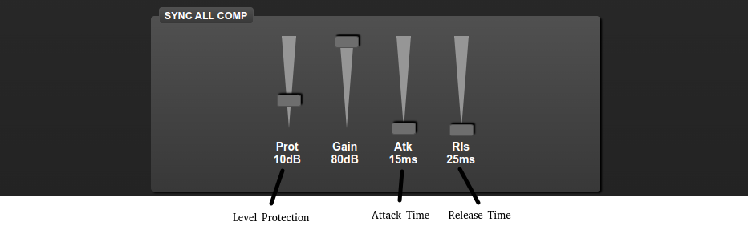

# Esp32 Multiband Digital Audio Processor

## Features

* Web interface for control and configuration.
* Adjustment of the number of frequency bands in real time from 1 to 10.
* Graphic equalizer.
* Audio echo.
* Independent or synchronized adjustments for each audio compressor.
* Audio VU (low speed).
* Audio balance adjustment.
* Audio Pre-emphasis and Post-emphasis by software.
* Output audio peak protection system.
* Settings saving system with preset files.
* Circuit power supply directly from the USB port.
* Simplified scheme with a low number of electronic components.

Audio level and main

Compressor

Digital Audio Processor

Prototype

## Tips

* The recommended input level is 15dB for PC volume control at 50%.
* To change a slider, first click on it and move it with the directional keys for better precision.
* The default access credentials are admin/admin.
* The WiFi AP credentials are DAP/123mudar.
* The Web interface IP is http://192.168.4.1

## Dependencies

* https://github.com/junon10/STM32F411_USB_AUDIO_DAC
* https://github.com/junon10/yummyDSP
* https://github.com/junon10/ArduinoJson (old ArduinoJson 5.x)

# Hardware

* 1 ESP32 MH ET LIVE WROOM DevKIT
* 1 STM32F411 BlackPill
* 1 PCM5102A DAC board

# Notes

* This dynamic audio compression library is not perfect due to the insufficient speed of esp32, which makes it impossible to use real-time logarithm functions for more than two simultaneous frequency bands. In practice with this lib you get a good effect, but with a not very wide input dynamic range.

* There are other compressor variations, for example the unlinked MonoCompressor, which I will add to this code in the next updates.
